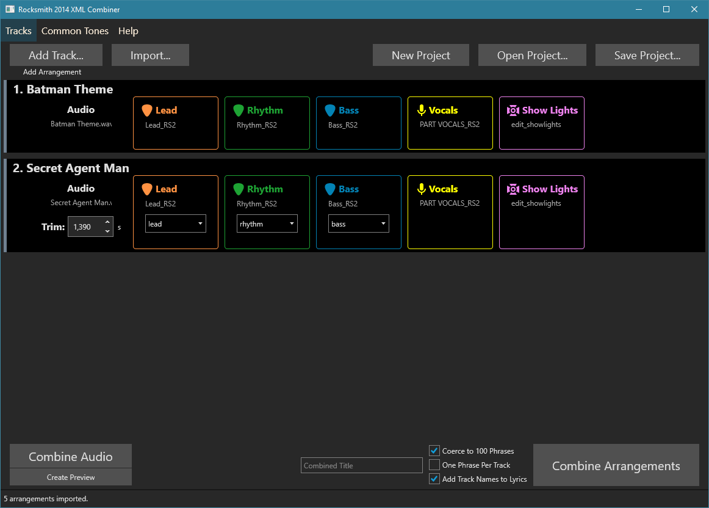

# Rocksmith 2014 XML Combiner

A tool that can stitch together Rocksmith 2014 XML files and combine audio files.

Created mainly for CDLC makers who want to combine customs they have made into a full album CDLC.

## Usage

* Add tracks by manually selecting the XML arrangements or by importing a Toolkit template.
* In the Common Tones tab, add the tone names you want to use for each arrangement. The base tone is the tone the combined arrangement begins with.
* For each of the arrangements, either set the base tone using the dropdown, or set the replacement tones with the Tones button.
